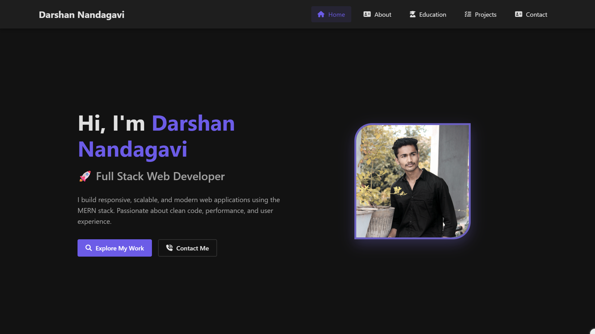
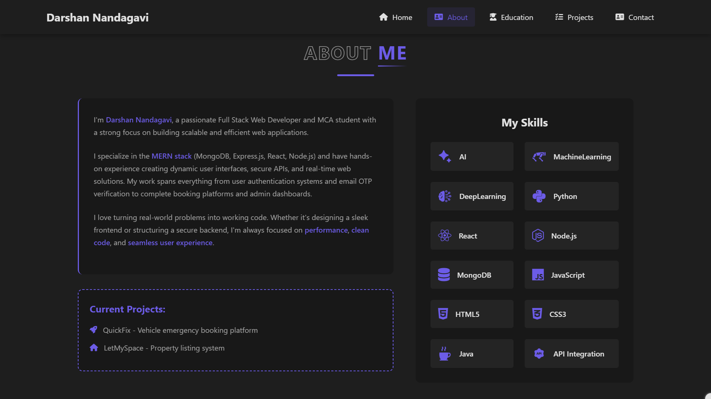
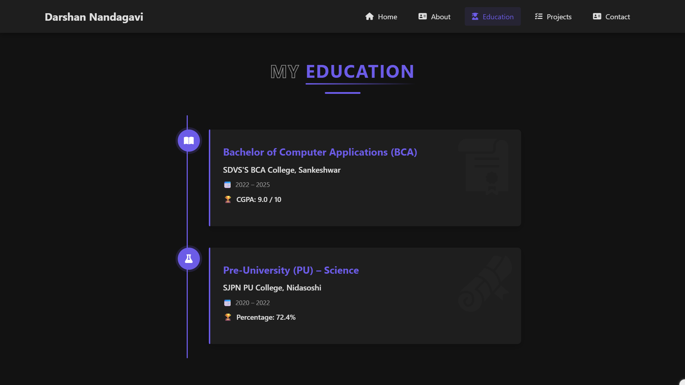
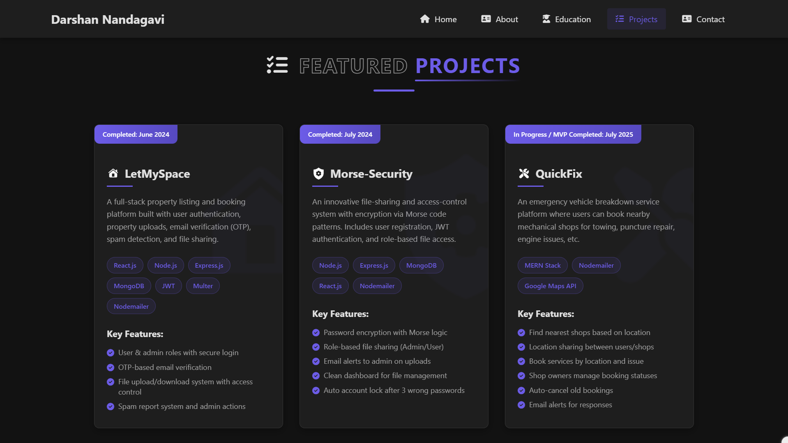
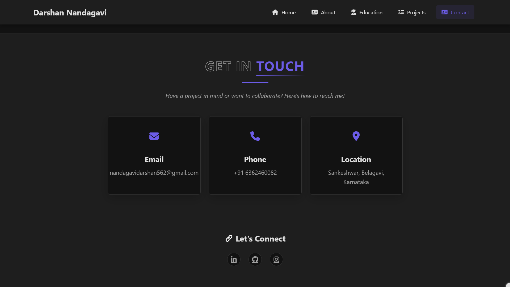

# Darshan Nandagavi | Full Stack Web Developer

Hi, I'm **Darshan Nandagavi**, a passionate **Full Stack Web Developer**. I build responsive, scalable, and modern web applications using the **MERN stack**. I focus on clean code, performance, and delivering seamless user experiences.

---

## About Me

I am an MCA student with expertise in:

- **MERN Stack:** MongoDB, Express.js, React, Node.js  
- User authentication & email OTP verification  
- Real-time web solutions and admin dashboards  
- Building scalable, efficient web applications  

**Current Projects:**

- 🚀 **QuickFix** - Emergency vehicle booking platform  
- 🏠 **LetMySpace** - Property listing and booking system  

I enjoy turning real-world problems into working, performant code.

---

## Skills

- **AI / Machine Learning / Deep Learning**
- **Programming Languages:** Python, Java, JavaScript, HTML5, CSS3  
- **Frameworks / Libraries:** React.js, Node.js, Express.js  
- **Database:** MongoDB  
- **Tools & APIs:** JWT, Multer, Nodemailer, API Integration  

---

## Education

**Bachelor of Computer Applications (BCA)**  
SDVS'S BCA College, Sankeshwar | 2022 – 2025  
CGPA: 9.0 / 10  

**Pre-University (PU) – Science**  
SJPN PU College, Nidasoshi | 2020 – 2022  
Percentage: 72.4%

---

## Projects

### LetMySpace
A full-stack property listing and booking platform with:
- User authentication & admin roles  
- OTP-based email verification  
- File upload/download with access control  
- Spam report system  

**Tech Stack:** React.js, Node.js, Express.js, MongoDB, JWT, Multer, Nodemailer  

---

### Morse-Security
File-sharing system with Morse code encryption:
- Password encryption using Morse logic  
- Role-based file access  
- Email alerts to admin on uploads  
- Auto account lock on failed login attempts  

**Tech Stack:** Node.js, Express.js, MongoDB, React.js, Nodemailer  

---

### QuickFix
Emergency vehicle breakdown service:
- Find nearest shops by location  
- Location sharing between users & shops  
- Booking management with auto-cancel for old bookings  
- Email notifications for responses  

**Tech Stack:** MERN Stack, Nodemailer, Google Maps API  

---

### Jarvis – Smart AI Assistant
AI-powered voice assistant for:
- Email and WhatsApp automation  
- Voice command recognition  
- Multilingual support  
- Task automation using Gemini API  

**Tech Stack:** Python, SpeechRecognition, Pyttsx3, Gemini API, Web Automation  

---

## Contact

Feel free to reach out for collaborations or projects:

- **Email:** [nandagavidarshan562@gmail.com](mailto:nandagavidarshan562@gmail.com)  
- **Phone:** [+91 6362460082](tel:+916362460082)  
- **Location:** Sankeshwar, Belagavi, Karnataka  

**Connect with me:**

- [LinkedIn](https://www.linkedin.com/in/darshan-nandagavi/)  
- [GitHub](https://github.com/Darshannandagavi)  
- [Instagram](https://www.instagram.com/mr_darshan_nandagavi/)  

---

**Let's connect and build something awesome together!**
